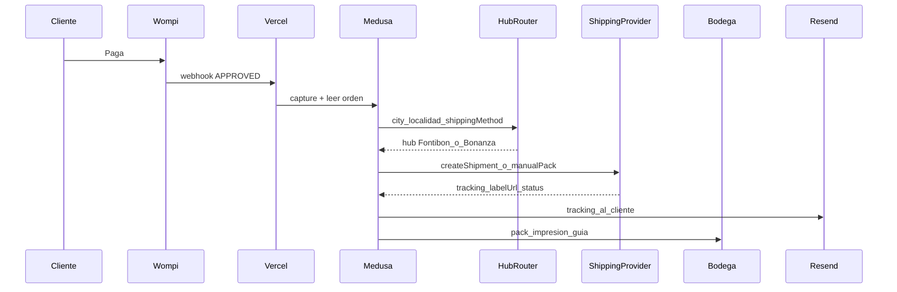

# Plan: envíos dual-hub Bogotá + Pibox (faseado)

## Decisiones cerradas

- **Stock único** en ambos puntos: el hub solo define **origen de despacho** (quién prepara y entrega al mensajero), no inventario Medusa separado.
- **Sin API Pibox aún**: Fase 1 operativa sin Pibox; Fase 2 enchufa Pibox detrás del mismo contrato `ShippingProvider`.
- **Persistencia**: metadata del pedido en Medusa (Postgres en Supabase). No hace falta un segundo “proyecto Supabase” aparte.
- **Email**: desde Vercel (Resend) tras crear el despacho; no depender de triggers SQL al inicio.

## Contexto actual

- Métodos fijos en `[lib/catalog.ts](lib/catalog.ts)`: pickup Fontibón/Bonanza ($0), domicilio Bogotá ($8.000), nacional ($18.000).
- Checkout solo pide `city` + `address` (`[app/checkout/page.tsx](app/checkout/page.tsx)`); no hay **localidad**.
- Wompi ya captura pago: Vercel `[app/api/payments/wompi/webhook/route.ts](app/api/payments/wompi/webhook/route.ts)` → Medusa `[/hooks/wompi](backend/apps/backend/src/api/hooks/wompi/route.ts)`.
- Fulfillment Medusa es **manual**; no hay transportador integrado.

## Flujo objetivo




## Reglas de ruteo (Bogotá / Colombia)


| Destino                                                                                                                                                                                                   | Hub origen                                      |
| --------------------------------------------------------------------------------------------------------------------------------------------------------------------------------------------------------- | ----------------------------------------------- |
| Localidades **Norte/Nororiente**: Chapinero, Usaquén, Suba, Barrios Unidos, Engativá (norte), Teusaquillo (norte), etc.                                                                                   | **Bonanza**                                     |
| Localidades **Sur/Occidente/centro-sur**: Fontibón, Kennedy, Bosa, Puente Aranda, Ciudad Bolívar, Tunjuelito, Rafael Uribe, San Cristóbal, Usme, Antonio Nariño, Los Mártires, Santa Fe, Candelaria, etc. | **Fontibón**                                    |
| Empate / localidad desconocida en Bogotá                                                                                                                                                                  | **Fontibón** (hub nacional por defecto)         |
| Fuera de Bogotá (nacional)                                                                                                                                                                                | **Fontibón**                                    |
| Pickup Fontibón / Bonanza                                                                                                                                                                                 | Sin courier; hub = punto elegido por el cliente |


Implementación: mapa estático `localidad → hub` en algo como `[lib/shipping/hub-routing.ts](lib/shipping/hub-routing.ts)` + normalización de texto (sin tildes, case-insensitive). Código postal queda como campo opcional de apoyo; **la decisión primaria es localidad** (en Bogotá el código postal es poco usado por clientes).

## Fase 1 — Operación sin API Pibox (implementar ya)

### 1) Checkout: capturar localidad

- En domicilio Bogotá: selector de **localidad** (lista oficial bogotana).
- En nacional: ciudad libre + departamento opcional.
- Guardar en dirección/metadata del cart/order: `locality`, `hub_origin`, `shipping_method_id`.
- Archivos: `[app/checkout/page.tsx](app/checkout/page.tsx)`, `[app/api/checkout/route.ts](app/api/checkout/route.ts)`.

### 2) Motor de ruteo

- `resolveDispatchHub({ shippingMethodId, city, locality })` → `{ hub: "fontibon" | "bonanza" | "pickup", address, label }`.
- Precios de cliente **no cambian** ($0 / $8k / $18k); el hub solo optimiza tiempo operativo.

### 3) Despacho al aprobar Wompi

Extender el flujo post-capture en Medusa o en Vercel (preferencia: **Vercel orquesta**, Medusa guarda estado):

1. Webhook Wompi verifica firma y captura (ya existe).
2. Si método es `delivery-*`, calcular hub y crear registro de envío en metadata:
  - `shipping_hub`, `shipping_status: pending_dispatch`, `shipping_provider: manual_pibox`.
3. Generar **pack de despacho** para la bodega (JSON + página Admin o email interno):
  - pedido, items, dirección, localidad, hub, peso estimado default (p.ej. 0.5 kg perfume).
4. Email al cliente: “pago recibido; preparando envío desde {hub}” (tracking llega en Fase 2 o cuando ops pegue guía).

### 4) UI operativa mínima

- En Medusa Admin o ruta custom `/admin/perfumas/shipping`: listar pedidos `pending_dispatch` filtrados por hub.
- Acción “Marcar despachado” + pegar `tracking_number` / URL guía (manual desde app Pibox hasta tener API).
- Opcional: WhatsApp deep-link al equipo de cada hub.

### 5) Cuenta Pibox (paralelo de negocio, no código)

- Abrir cuenta corporativa Pibox Colombia.
- Registrar **dos orígenes**: Fontibón y Bonanza con direcciones reales.
- Pedir documentación API + keys sandbox/producción.
- Validar cobertura Bogotá same-day/next-day y nacional (si nacional no aplica en Pibox, Fase 2 solo Bogotá; nacional sigue manual con Interrapidísimo/Coordinadora usando el mismo hub Fontibón).

## Fase 2 — Integración API Pibox

### Adapter

```ts
// lib/shipping/providers/pibox.ts
createShipment({ originHub, destination, weight, reference })
  → { trackingNumber, labelUrl, externalId }
```

- Env vars: `PIBOX_API_URL`, `PIBOX_API_KEY`, `PIBOX_ORIGIN_FONTIBON_ID`, `PIBOX_ORIGIN_BONANZA_ID`.
- Provider `manual` queda como fallback si Pibox falla (pedido no se pierde).

### Orquestación

Tras `wompi_status: APPROVED` y hub resuelto:

1. `POST` Pibox con origen del hub + destino cliente.
2. Guardar en order metadata: `tracking_number`, `label_url`, `shipping_status: label_created`, `pibox_shipment_id`.
3. Email cliente con tracking + link.
4. Email/webhook interno a la bodega con PDF de guía (impresión).

### Webhooks Pibox (si existen)

- Actualizar `shipping_status` (`picked_up`, `in_transit`, `delivered`, `failed`).
- Mostrar estado en `/cuenta` o página de resultado del pedido.

## Mejoras vs tu borrador

- No “asignar inventario” de bodega: stock compartido → solo origen de pickup del courier.
- No Edge Function obligatoria: Route Handler Node en Vercel (más simple para PDF/fetch largos).
- No depender de trigger SQL Supabase para email: Resend desde la misma función.
- Localidad obligatoria en Bogotá (código postal opcional).
- Fase 1 te deja operar la ventaja de 2 hubs **antes** de tener API.

## Alcance fuera de este plan

- Inventario multi-warehouse Medusa.
- Cotización dinámica de flete al cliente (se mantienen $8k / $18k).
- Impresión térmica automática en tienda (solo PDF/URL en Fase 2).

## Orden de implementación sugerido

1. Localidad en checkout + metadata en order.
2. `hub-routing` + tests de localidades.
3. Post-Wompi: asignar hub + pack operativo + emails.
4. Panel/listado pending por hub + pegar tracking manual.
5. Cuando llegue API Pibox: implementar adapter y sustituir el paso manual.

